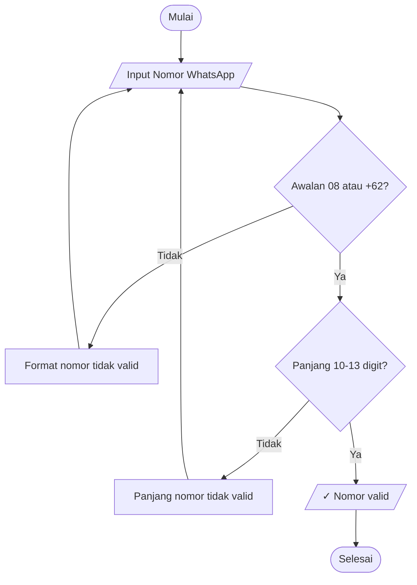

# Tugas Mandiri 02c — Flowchart Validasi Nomor WhatsApp

Nama: [Abdullah Mufid A]

```mermaid
flowchart TD
    A([Mulai]) --> B[/Input Nomor WhatsApp/]
    B --> C{Awalan 08 atau +62?}

    C -- Tidak --> D[Format nomor tidak valid]
    D --> B

    C -- Ya --> E{Panjang 10-13 digit?}

    E -- Tidak --> F[Panjang nomor tidak valid]
    F --> B

    E -- Ya --> G[/✓ Nomor valid/]
    G --> H([Selesai])
```
