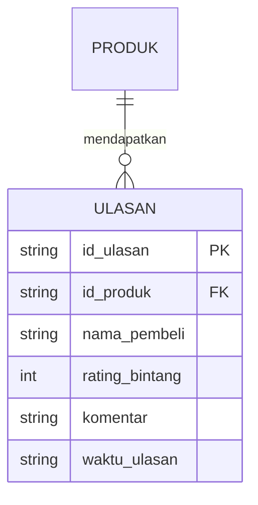

```mermaid
erDiagram
    PRODUK ||--o{ ULASAN : "mendapatkan"

    ULASAN {
        string id_ulasan PK
        string id_produk FK
        string nama_pembeli
        int rating_bintang
        string komentar
        string waktu_ulasan
    }
```
